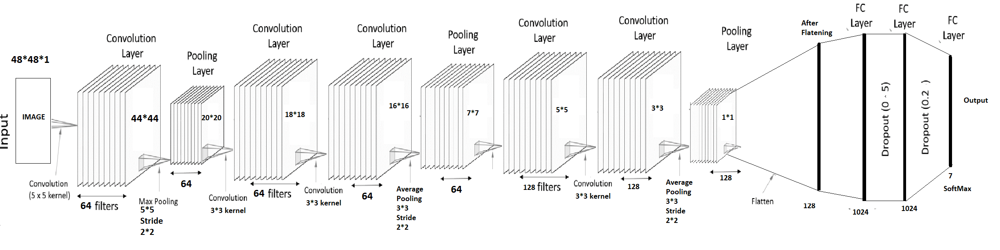

Facial Emotion Recognition: We used Deep learning aproch for classifying given face into 7 emotions. 
Dataset can be downloaded from https://www.kaggle.com/c/challenges-in-representation-learning-facial-expression-recognition-challenge/data 

